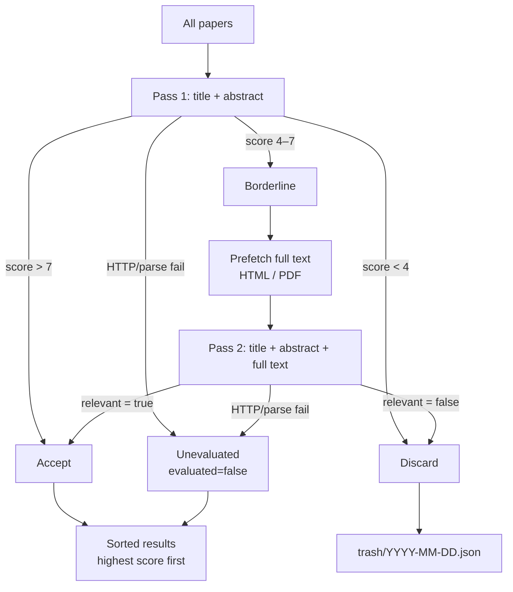

# Everyday arXiv

---

## Features / 功能特性

- **Category-based fetching** — monitor any arXiv category (e.g. `hep-ph`, `astro-ph.CO`, `gr-qc`).
- **LLM relevance filtering** — describe your research interests in plain text; an LLM scores each paper 1–10 and decides relevance.
- **Decoupled pipeline** — fetch and filter are separate steps.  Re-run the filter with a different profile without re-fetching.
- **Incremental filtering** — already-evaluated papers are skipped on subsequent runs; only new, updated, or previously-failed papers are sent to the LLM.
- **Adaptive concurrency** — automatically backs off on HTTP 429 rate-limit errors and recovers when the API stabilises.
- **Unified retry** — single `max_retries` / `max_backoff` controls all retry scenarios (HTTP 429/5xx, timeouts, empty content, JSON parse failures).
- **Reasoning model support** — auto-fallback from `reasoning_content` to `content` for models like GLM-5.1 / DeepSeek-R1.
- **Date-aware raw storage** — papers are filed by first submission / latest update date with automatic intermediate cleanup.
- **Trash management** — discarded papers saved with rejection reasons; auto-cleanup after N days.
- **Data/code branch separation** — code lives on `main`; data lives on an orphan `data` branch.
- **Static frontend** — vanilla JS SPA reads data from the `data` branch via `raw.githubusercontent.com`.
- **GitHub Actions** — runs automatically every day at UTC 08:00, pushes data, and deploys GitHub Pages.
- **Any OpenAI-compatible API** — swap `base_url` to use Azure, Ollama, Together AI, etc.

---

## Installation / 安装

### Prerequisites / 前置条件

- Python ≥ 3.11
- [uv](https://docs.astral.sh/uv/) (recommended) or pip

### Install / 安装

```bash
git clone https://github.com/Fenyutanchan/everyday-arXiv.git
cd everyday-arXiv

# Runtime only / 仅运行时
uv sync

# With test dependencies / 含测试依赖
uv sync --extra dev
```

### Local API Key / 本地密钥管理

```bash
cp .env.example .env
# Edit .env with your values / 编辑 .env 填入你的配置
```

`.env` file:

```bash
LLM_API_KEY=sk-...
LLM_BASE_URL=https://api.openai.com/v1
LLM_MODEL=gpt-4o-mini
```

Environment variables take priority over `config.yaml`.

> 环境变量优先级高于配置文件。

---

## Usage / 使用方法

### `fetch` — Fetch papers from arXiv

```bash
# Fetch papers from the last 1 day (default)
uv run python -m src.main fetch --days 1

# Fetch papers from the last 3 days
uv run python -m src.main fetch --days 3
```

| Flag | Default | Description / 描述 |
|------|---------|---------------------|
| `--days` | `1` | How many days back to fetch / 回溯天数 |
| `--config` | `config/config.yaml` | Config file path / 配置文件路径 |

No API key required.  Results are sorted by **last updated date** (descending), capturing both new submissions and recently replaced / cross-listed papers.  The client **auto-paginates** with no total cap — it keeps fetching until it encounters papers outside the date window.  Writes raw JSON to `data/YYYY-MM-DD.json`.

> 无需 API 密钥。结果按**最近更新日期**降序排列，同时捕获新提交和最近替换/跨分类的论文。客户端**自动翻页**，总数无上限——持续获取直到遇到超出日期窗口的论文。输出原始数据到 `data/YYYY-MM-DD.json`。

### `filter` — Run LLM filter on saved data

```bash
export LLM_API_KEY="sk-..."
uv run python -m src.main filter --date 2026-04-19

# Default date is today / 默认日期为今天
uv run python -m src.main filter
```

| Flag | Default | Description / 描述 |
|------|---------|---------------------|
| `--date` | today | Date of raw data to filter (`YYYY-MM-DD`) / 要筛选的原始数据日期 |
| `--config` | `config/config.yaml` | Config file path / 配置文件路径 |

Reads raw papers from `data/YYYY-MM-DD.json`, sends them to the LLM, and writes results to `output/YYYY-MM-DD.json` (organised by **run date**, not article date).

Papers already successfully evaluated in previous runs are **automatically skipped** unless their `updated` field has changed.  Only new, updated, or previously-unevaluated papers consume LLM API calls.

> 从 `data/` 读取原始论文，经 LLM 评估后写入 `output/YYYY-MM-DD.json`（按运行日期组织）。已成功评估的论文自动跳过，仅新论文、有更新的论文或上次评估失败的论文会调用 LLM。

### `refilter` — Re-evaluate failed papers

```bash
uv run python -m src.main refilter --date 2026-04-19
```

| Flag | Default | Description / 描述 |
|------|---------|---------------------|
| `--date` | today | Date of filtered output to refilter (`YYYY-MM-DD`) / 要重新筛选的输出日期 |
| `--config` | `config/config.yaml` | Config file path / 配置文件路径 |

Re-runs only papers marked `evaluated=false` from a previous filter run.  Already-evaluated papers are preserved.

> 仅重新评估上次标记为 `evaluated=false` 的论文，已评估的保留不动。

### `cleanup` — Remove old trash files

```bash
# Remove trash files older than 7 days (default)
uv run python -m src.main cleanup

# Keep trash files from the last 30 days
uv run python -m src.main cleanup --keep 30
```

| Flag | Default | Description / 描述 |
|------|---------|---------------------|
| `--keep` | `7` | Keep trash files from the last N days / 保留最近 N 天的 trash 文件 |
| `--config` | `config/config.yaml` | Config file path / 配置文件路径 |

Scans `trash/YYYY-MM-DD.json` files and removes any older than the specified retention period.

> 扫描 `trash/` 目录，删除超过保留期的文件。

---

## Configuration / 配置说明

All settings live in `config/config.yaml`.

> 所有配置在 `config/config.yaml` 中。

```yaml
categories:
  - hep-ph
  - astro-ph.CO
  - gr-qc
  - hep-th

fetch:
  page_size: 100         # Results per API request / 每次 API 请求结果数（总数无上限）

output:
  raw_dir: data          # Raw fetched data / 原始拉取数据
  filtered_dir: output   # Filtered results / 筛选结果
  trash_dir: trash       # Discarded papers with reasons / 被丢弃的论文（含理由）

llm:
  base_url: https://api.openai.com/v1
  base_url_env: LLM_BASE_URL           # Env var override / 环境变量覆盖
  model: gpt-4o-mini
  model_env: LLM_MODEL                  # Env var override / 环境变量覆盖
  api_key_env: LLM_API_KEY
  max_concurrent: 3                     # Max parallel requests / 最大并发请求数
  initial_concurrent: 1                 # Starting concurrency / 起始并发数（自动爬升）

  max_retries: 3                        # Unified retry for HTTP/timeout/parse / 统一重试次数
  max_backoff: 32                       # Max backoff delay in seconds / 最大退避延迟（秒）
  max_tokens: 4096                      # Max completion tokens / 最大补全 token 数
                                          # (2048+ for reasoning models / 推理模型建议 2048+)

  timeout_connect: 10                   # TCP connect timeout / TCP 连接超时
  timeout_read: 60                      # LLM response timeout / LLM 响应超时
  timeout_write: 10                     # Request body send timeout / 请求体发送超时
  timeout_pool: 10                      # Connection pool wait timeout / 连接池等待超时

  use_html: true
  use_pdf: false
  max_content_chars: 50000

  borderline_min: 4
  borderline_max: 7

  research_profile_file: config/research_profile.md
  research_profile: |
    I am researching ...
```

### Tuning the Research Profile / 调优研究兴趣描述

Edit `config/research_profile.md` (or the inline `research_profile` in config).  Re-run `filter` — **no need to re-fetch**.

> 编辑 `config/research_profile.md`（或配置中的内联 `research_profile`），重新运行 `filter` 即可——**无需重新拉取**。

### Using Non-OpenAI Providers / 使用非 OpenAI 提供商

Set environment variables (no config change needed):

> 设置环境变量即可，无需改配置：

```bash
export LLM_BASE_URL=http://localhost:11434/v1   # Ollama
export LLM_MODEL=llama3
```

---

## Filtering Pipeline / 筛选流程

The `filter` command uses a **two-pass agent loop** with **adaptive concurrency**.

> `filter` 命令使用**两轮 Agent 循环**和**自适应并发**。

### Pass 1 — Quick Screen / 第一轮：快速筛选

Every paper is evaluated using **title + abstract only** — no full text is fetched. The LLM returns a score (1–10) and a relevance decision.

> 每篇论文仅用**标题+摘要**评估，不拉取全文。LLM 返回 1–10 分和相关性判断。

| Score range / 分数范围 | Action / 处理方式 |
|---|---|
| `> borderline_max` (e.g. 8–10) | **Accepted** — no further review / 直接通过 |
| `borderline_min` – `borderline_max` (e.g. 4–7) | **Borderline** — proceeds to Pass 2 / 进入第二轮 |
| `< borderline_min` (e.g. 1–3) | **Discarded** / 丢弃 |

### Pass 2 — Deep Review / 第二轮：深度复审

Borderline papers are **re-evaluated with full text** (HTML or PDF). The LLM gets the complete paper content alongside the abstract and makes a final relevance decision.

> 边界论文会获取**全文**（HTML 或 PDF）后重新评估。LLM 结合完整论文内容做出最终判断。

- **PDF preferred over HTML** when both are available.
  > PDF 和 HTML 同时可用时优先使用 PDF。
- Full text is truncated to `max_content_chars` (default: 50 000 characters).
  > 全文截断至 `max_content_chars`（默认 50 000 字符）。
- If content fetching is disabled (`use_html: false`, `use_pdf: false`), Pass 2 still runs but without full text.
  > 如果全文获取关闭，第二轮仍会运行但没有全文。

### Retry & Adaptive Concurrency / 重试与自适应并发

All retry scenarios are controlled by a single `max_retries` / `max_backoff` pair:

> 所有重试场景由统一的 `max_retries` / `max_backoff` 控制：

| Failure type / 失败类型 | Behaviour / 行为 |
|---|---|
| **HTTP 429 / 5xx** | Retry with exponential backoff (`delay = min(2^n, max_backoff)`) / 指数退避重试 |
| **Timeout** (`httpx.ReadTimeout`, etc.) | Same unified retry / 同样走统一重试 |
| **Empty response content** | Same unified retry / 同样走统一重试 |
| **JSON parse failure** | Retry with a correction hint appended to prompt / 附加修正提示后重试 |

The adaptive semaphore (inspired by TCP congestion control) adjusts concurrency:

> 自适应信号量（参考 TCP 拥塞控制）自动调节并发：

| Event / 事件 | Action / 动作 |
|---|---|
| **Success** (probe phase) | `limit = limit × 2` — fast ramp-up / 快速爬升 |
| **Success** (stable phase, after reaching max) | `limit += 1` — linear growth / 线性增长 |
| **Failure** | `limit -= 1` — gentle back-off / 温和回退 |
| **Same level fails 3 times** | Ceiling confirmed — effective max capped at `level - 1` / 确认上限，封顶 |

**Unevaluated papers** — if all retries are exhausted, the paper is **included in output** with `evaluated=false` so it is never silently lost.  Run `refilter` to retry later.

> **未评估论文** — 全部重试耗尽后以 `evaluated=false` 保留在输出中，不会静默丢失。后续可用 `refilter` 重新评估。

### Reasoning Model Support / 推理模型支持

For reasoning models (GLM-5.1, DeepSeek-R1, etc.) that put their output in `reasoning_content` instead of `content`, the filter automatically falls back to parsing JSON from `reasoning_content`.  Set `max_tokens` to 2048+ to ensure enough budget for both reasoning and the JSON output.

> 推理模型将输出放在 `reasoning_content` 中时，筛选器会自动回退解析。设置 `max_tokens` 为 2048+ 以确保足够空间。

### Flow Diagram / 流程图



---

## Storage Model / 存储模型

### Three Directories / 三个目录

| Directory / 目录 | Content / 内容 |
|---|---|
| `data/` | Raw fetched papers, organised by article published/updated date / 原始拉取数据，按文章日期组织 |
| `output/` | Filtered results, organised by **filter run date** / 筛选结果，按运行日期组织 |
| `trash/` | Discarded papers with rejection reasons, organised by **filter run date** / 被丢弃的论文（含拒绝理由），按运行日期组织 |

### Raw Filing Rules / 原始归档规则

Papers in `data/` are tracked by **base arXiv ID** (version stripped):

> `data/` 中的论文通过 **base arXiv ID**（去除版本号）追踪：

| Scenario / 场景 | Where the record lives / 记录位置 |
|---|---|
| First submission / 首次提交 | File for the `published` date only / 仅在 `published` 日期文件中 |
| Single replacement / 单次替换 | `published` date **+** `updated` date / `published` 日期 **+** `updated` 日期 |
| Multiple replacements / 多次替换 | `published` date **+** latest `updated` date only; intermediate dates cleaned up / 仅保留首次和最新日期；中间日期自动清除 |

### Filtered Output / 筛选输出

Filtered output is a **single file per run date** — all relevant papers from that run are in `output/YYYY-MM-DD.json`.

> 筛选输出按运行日期存储，每次运行一个文件 `output/YYYY-MM-DD.json`。

### Discarded Papers / 被丢弃的论文

Papers that score below `borderline_min` or are rejected in Pass 2 are saved to `trash/YYYY-MM-DD.json` with their rejection reasons.  Use the `cleanup` subcommand to remove old trash files.

> 低于 `borderline_min` 或在第二轮被拒绝的论文保存到 `trash/YYYY-MM-DD.json`，附拒绝理由。使用 `cleanup` 子命令清理旧文件。

### Incremental Filtering / 增量筛选

On each `filter` run:

1. Scan all existing files in `output/` to build an index of previously evaluated papers.
2. For each raw paper:
   - **Already `evaluated=true`** and `updated` unchanged → **skip** (carry over as-is).
   - **`evaluated=false`** or `updated` has changed → send to LLM.
3. Merge new results with carried-over results, sort by score.

> 每次 `filter` 运行时：扫描 `output/` 历史结果，已成功评估且未更新的论文自动跳过，仅对新增/更新/失败的论文调用 LLM。

### Directory Example / 目录示例

```
data/
├── 2026-04-14.json            # Raw: papers published/updated on Apr 14
├── 2026-04-18.json            # Raw: papers published/updated on Apr 18
└── 2026-04-19.json            # Raw: papers published/updated on Apr 19
output/
├── 2026-04-19.json            # Filtered: run on Apr 19
└── 2026-04-20.json            # Filtered: run on Apr 20 (carries over Apr 19 results)
trash/
├── 2026-04-19.json            # Discarded papers from Apr 19 run
└── 2026-04-20.json            # Discarded papers from Apr 20 run
```

### Output Format / 输出格式

Raw file (`data/YYYY-MM-DD.json`):

```json
{
  "date": "2026-04-14",
  "total": 42,
  "papers": [
    {
      "arxiv_id": "2501.12345v1",
      "base_id": "2501.12345",
      "title": "Paper Title",
      "authors": ["Alice", "Bob"],
      "abstract": "Paper abstract...",
      "categories": ["hep-ph", "gr-qc"],
      "published": "2026-04-14T10:30:00+00:00",
      "updated": "2026-04-14T10:30:00+00:00",
      "pdf_url": "https://arxiv.org/pdf/2501.12345v1",
      "html_url": "https://arxiv.org/html/2501.12345v1",
      "entry_url": "https://arxiv.org/abs/2501.12345v1"
    }
  ]
}
```

Filtered file (`output/YYYY-MM-DD.json`) — same structure with an added `relevance` field per paper:

> 筛选文件结构相同，每篇论文额外包含 `relevance` 字段：

```json
{
  "relevance": {
    "relevant": true,
    "score": 8,
    "reason": "Directly relevant to dark matter detection.",
    "pass_number": 1,
    "evaluated": true
  }
}
```

---

## Data / Code Branch Separation / 数据与代码分支分离

The project uses two Git branches to keep code and data separate:

> 项目使用两个 Git 分支来分离代码和数据：

| Branch / 分支 | Content / 内容 |
|---|---|
| `main` | Source code, config, tests, docs / 源代码、配置、测试、文档 |
| `data` | Orphan branch — only `output/`, `data/`, `trash/`, `dates.json` / 孤儿分支——仅数据文件 |

The `data` branch is force-pushed by GitHub Actions after each daily run.  The static frontend (`site-ui/index.html`) reads JSON directly from this branch via `raw.githubusercontent.com`.

> `data` 分支由 GitHub Actions 在每次日运行后强制推送。静态前端通过 `raw.githubusercontent.com` 直接读取此分支上的 JSON。

---

## GitHub Actions / 自动化

The included workflow runs daily at UTC 08:00 — it fetches, filters, refilters, cleans up, pushes data, and deploys Pages.

> 内置工作流每天 UTC 08:00 自动运行，依次执行以下步骤。

### Pipeline Steps / 工作流步骤

1. **Fetch** — `fetch --days 1`
2. **Filter** — `filter` (incremental, skips already-evaluated papers)
3. **Refilter** — `refilter` (retries papers with `evaluated=false`)
4. **Cleanup** — `cleanup --keep 7` (removes trash files older than 7 days)
5. **Generate dates index** — creates `dates.json` (last 90 dates)
6. **Push to `data` branch** — orphan branch with only data files
7. **Build docs & frontend** — `mkdocs build` + copy `site-ui/`
8. **Deploy GitHub Pages** — via `peaceiris/actions-gh-pages`

### Required Secrets / 必须配置的 Secrets

Go to **Settings → Secrets and variables → Actions** and add:

> 进入 **Settings → Secrets and variables → Actions**，添加：

| Secret | Description / 描述 |
|---|---|
| `LLM_API_KEY` | API key for the LLM / LLM API 密钥 |
| `LLM_BASE_URL` | *(optional)* API endpoint / API 端点（可选） |
| `LLM_MODEL` | *(optional)* Model name / 模型名称（可选） |

### Manual Trigger / 手动触发

Trigger from the Actions tab with custom parameters:

> 在 Actions 页面手动触发，支持自定义参数：

- **days** — number of days to look back / 回溯天数
- **date** — specific date to filter / 要筛选的日期

---

## Project Structure / 项目结构

```
src/
├── fetcher.py    # arXiv API client + HTML detection / arXiv API 客户端
├── filter.py     # LLM filter + adaptive concurrency / LLM 筛选 + 自适应并发
├── storage.py    # JSON persistence (raw + filtered + trash) / JSON 持久化
└── main.py       # CLI entry point (fetch / filter / refilter / cleanup) / 命令行入口
tests/
├── test_fetcher.py
├── test_filter.py
├── test_storage.py
└── test_main.py
config/
├── config.yaml             # Configuration / 配置文件
└── research_profile.md     # Research interests / 研究兴趣描述
site-ui/
└── index.html              # Static frontend (vanilla JS) / 静态前端
.github/workflows/
├── daily-arxiv.yml         # Daily fetch + filter + deploy / 日工作流
└── ci.yml                  # Push/PR test / 推送/PR 测试
docs/
└── index.md                # This documentation / 本文档
.env.example                # Environment variable template / 环境变量模板
mkdocs.yml                  # MkDocs configuration / MkDocs 配置
```

---

## License

MIT
